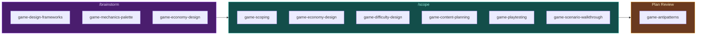

# Game Spice

Game design spice for [Line Cook](https://github.com/smileynet/line-cook) — MLP scoping, core loop frameworks, economy design, difficulty curves, content planning, mechanics palette, playtesting methodology, scenario walkthroughs, and planning anti-patterns.

## Quick Start

After [installing Line Cook](https://github.com/smileynet/line-cook#installation):

```bash
/plugin marketplace add smileynet/line-cook
/plugin install game-spice@line-cook
/line:mise                                    # Plan a game
```

> **New here?** See the [tutorial](docs/tutorial.md) for a complete walkthrough planning a roguelike dungeon crawler.

Update: `/plugin update game-spice`

## What It Looks Like

Here's a brainstorming session with game-spice active. The skills inject game-specific questions and frameworks automatically:

```
You: I want to make a roguelike dungeon crawler.

Claude: Let's explore that! First, some questions to shape the concept:

**What aesthetic are you targeting?**                     ← game-design-frameworks
MDA gives us 8 aesthetics. For a roguelike, the primary
candidates are Challenge, Discovery, and Sensation.
Which 1-2 resonate most?

You: Challenge and Discovery.

Claude: Good combo. Now let's nail the core loop:

**Can you describe your core loop in one sentence?**     ← game-scoping
Format: "Player [verbs] to [goal], earning [reward]
that enables [reinvestment]."

You: Player explores rooms to find loot, earning gear
     that enables deeper dungeon runs.

Claude: That's a clean loop. Let's browse mechanics
that could make exploration feel distinct:

**What movement style fits your vision?**                ← game-mechanics-palette
From the palette: grid-based, free movement,
auto-runner, teleport, grapple/swing...
Grid-based is classic roguelike. Free movement
opens real-time combat options.

You: Grid-based, turn-based.

Claude: Classic choice. For the economy:

**How complex should the resource system be?**           ← game-economy-design
┌─────────────────┬─────────────────────────────────┐
│ None            │ Pure action, no currency         │
│ Single resource │ Gold only — simple, clear        │
│ Dual currency   │ Gold + XP — spend vs grow        │
│ Full economy    │ Multiple interacting resources    │
└─────────────────┴─────────────────────────────────┘
For an MLP roguelike, dual currency is the sweet spot.
```

Each question comes from a different skill, but they flow as a natural conversation. Game-spice doesn't change what Line Cook does — it changes what Claude *knows to ask about* during planning.

## When to Use

**Use game-spice when:**
- Planning a new game project with `/line:mise`
- Scoping an MLP and need to cut features ruthlessly
- Designing core loops, economies, or difficulty curves
- Checking your plan for common game design anti-patterns

**Skip it when:**
- Building non-game software (game-spice only adds game concepts)
- Already past planning into implementation (skills are planning-phase only)
- Working on a game engine or tooling project (not game design)

## What's Inside

| Skill | Activates During | Key Topics |
|-------|-------------------|------------|
| **game-scoping** | `/scope`, MLP planning | MLP vs MVP, 3-feature rule, tracer bullets, MoSCoW, 30% rule |
| **game-design-frameworks** | `/brainstorm`, idea exploration | MDA framework, core loops, player motivation, systems thinking |
| **game-mechanics-palette** | `/brainstorm`, mechanic selection | 54 mechanics in 10 categories, mashup patterns, guided exploration |
| **game-economy-design** | `/brainstorm`, `/scope` | Taps & sinks, currency tiers, progression curves, genre patterns |
| **game-difficulty-design** | `/scope`, challenge design | Flow state, difficulty curves, accessibility, recovery mechanics |
| **game-content-planning** | `/scope`, world structure | World structure, pacing, procedural vs handcrafted, content reuse |
| **game-playtesting** | `/scope`, plan review | 3-question framework, MVPt, build-test-learn, pivot decisions |
| **game-scenario-walkthrough** | `/scope`, `/finalize` | 5-beat template, input/feedback mapping, experience narration |
| **game-antipatterns** | Plan review, scope audits | Top 10 anti-patterns, over-scoped rubric, pre/post-planning audits |

9 skills, 2400+ lines of game design guidance.

## How It Works

Skills load automatically when Line Cook commands detect game project context during `/mise` (brainstorm, scope, finalize). No configuration needed — skill descriptions contain trigger keywords that Claude matches against during planning sessions.



Skills can activate in multiple phases — `game-economy-design` appears in both brainstorm and scope because resource decisions start broad and get concrete.

## FAQ

**Do I need to configure anything?**
No. Install the plugin and plan a game. Skills activate automatically based on what you're discussing. There's no config file, no setup step.

**Does game-spice work without Line Cook?**
The skills are designed for Line Cook's `/mise` workflow (brainstorm → scope → finalize). Without Line Cook, Claude won't have the planning commands that trigger these skills.

**What about non-standard genres?**
The frameworks are genre-agnostic. MDA, core loops, difficulty curves, and economy design apply to any game — the genre-specific examples just help illustrate the concepts. The mechanics palette covers 10 categories spanning most game types.

**MLP vs MVP — what's the difference?**
MVP (minimum viable product) asks "what's the least we can ship?" MLP (minimum lovable product) asks "what's the least that's *worth playing*?" Games need to be fun, not just functional. Game-spice uses MLP throughout because a game that works but isn't fun has failed.

**Does game-spice help during implementation?**
No — it's planning-phase only. Once you move from `/mise` to `/run` (prep → cook → serve → tidy), game-spice has done its job. The plans and beads it helped create guide your implementation, but the skills don't activate during coding.

## Learn More

- [Tutorial](docs/tutorial.md) — Plan a roguelike dungeon crawler from scratch
- [Line Cook Tutorial](https://github.com/smileynet/line-cook/blob/main/docs/tutorial-claude-code.md) — Full workflow walkthrough
- [Changelog](CHANGELOG.md) — Version history

## Local Development

```bash
/plugin marketplace add /home/sam/code/game-spice
```

## Requirements

- Claude Code >= 1.0.33
- [Line Cook](https://github.com/smileynet/line-cook) plugin (for mise workflow integration)

## License

MIT
